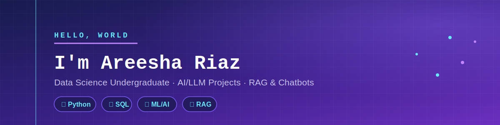

 

 

### 🧠 About Me

Data Science undergraduate (BS Data Science, University of the Punjab) with hands-on experience through internships, academic research, and independent projects. I work with Python, SQL, Machine Learning, and Data Engineering, and I'm especially interested in **LLM APIs, RAG pipelines, and AI-assisted development**.

- 🎓 BS Data Science, FCIT, University of the Punjab (2023 – 2027)
- 🤖 **AI Intern at DecodeLabs** (June – July 2026) — built chatbots, recommendation systems, and clustering models
- 🧪 **Data Science Intern at Developer Hub** — data preprocessing, EDA, and applied statistics
- 🤖 Built a **RAG pipeline** (HuggingFace + Groq LLM API) and a **TF-IDF based chatbot**
- 🛠️ Hands-on with **Claude Code** (via Ollama) for AI-assisted full-stack development
- 📎 Familiar with **n8n** (automation concepts) and **LangChain** (through coursework) — actively growing into AI agent & automation development
- 🎨 Also design UI/UX prototypes in Figma (freelance, Upwork)

### 📌 Featured Projects

- **NLP & RAG Chatbot** — TF-IDF vectorization, cosine similarity, semantic matching + a RAG pipeline integrating HuggingFace with Groq's LLM API
- **Full-Stack Web App (AI-Assisted)** — built end-to-end using Claude Code launched via Ollama
- **End-to-End ML Application** — full pipeline (preprocessing → feature engineering → training → evaluation) deployed with Streamlit
- **Social Media & Mental Health Research** — hypothesis testing (Z-test), correlation analysis, and ML pattern detection
- **Database & Power BI Analytics** — SQL/SSMS querying + Power BI dashboards for business insights

### 🛠️ Tech & Tools

### 📎 Contact & Links

- 💼 LinkedIn: [Areesha Riaz](https://www.linkedin.com/in/areesha-riaz-828282362/)
- 📧 Email: [areeshariaz553@gmail.com](mailto:areeshariaz553@gmail.com)
- 📄 Resume available on request

### 📊 GitHub Stats

⭐ Thanks for stopping by — more tasks and experiments coming soon.

